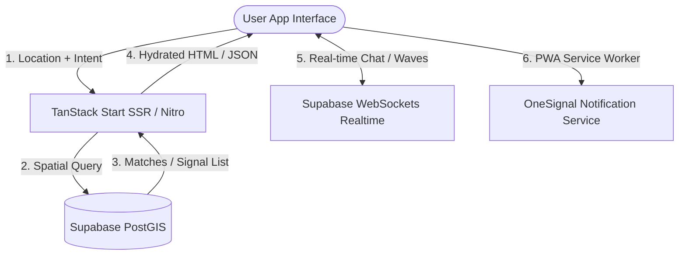

# ⚡ Flick — Ambient Social Layer for Physical Reality

<p align="center">
  
</p>

<p align="center">
  <strong>An ambient, location-aware social layer that connects people in real-time.</strong><br />
  Zero-rejection. Mutual-match only. Vibe-based. Mobile-first PWA.
</p>

<p align="center">
  <a href="#-key-features">Features</a> •
  <a href="#%EF%B8%8F-tech-stack">Tech Stack</a> •
  <a href="#-architecture">Architecture</a> •
  <a href="#%EF%B8%8F-database-schema">Database</a> •
  <a href="#-getting-started">Getting Started</a> •
  <a href="#-deployment">Deployment</a>
</p>

---

## 🌟 What is Flick?

**Flick** is a mobile-first Progressive Web App (PWA) designed to eliminate the friction and anxiety of real-life social discovery. Instead of swiping through digital-first profiles, Flick functions as an **ambient layer over physical reality**:

1. **Broadcast Presence**: Users check in at a location with their current vibe, intention, or note (e.g., "Grabbing coffee & open to chat about startup ideas").
2. **Geographical Matchmaking**: Leveraging Postgres + PostGIS, the app detects nearby users within a customizable radius.
3. **Mutual Wave Only**: You can "wave" to others nearby. However, to eliminate rejection anxiety, your wave is **entirely secret** until they wave back.
4. **Real-time Interaction**: A mutual wave reveals a temporary, location-locked channel with integrated real-time chat, profile highlights, and icebreakers.

---

## ✨ Key Features

- **📍 PostGIS-Powered Proximity Detection**: Precise, low-latency queries to fetch signals within a custom geographic radius.
- **🤫 Zero-Rejection Mutual Signaling**: Single-blind waves prevent awkward social interactions and foster natural connections.
- **📱 PWA & Push Notifications**: Fully responsive mobile experience installable as a native-like app, with background synchronization and push notifications powered by OneSignal.
- **💬 Real-time WebSockets Chat**: Low-latency direct messaging built on top of Supabase Realtime with rich typography and message states.
- **🎨 Interactive Onboarding**: Custom emoji-based avatar builders, interactive vibe selectors, and dynamic onboarding flows.
- **🛡️ Trust, Safety & Moderation**: Integrated blocking, muting, reporting, and safety systems built natively into the database layer via RLS policies.
- **💎 Premium Subscription Tier**: Fully integrated RevenueCat JS SDK supporting premium features, unlimited waves, and extended range controls.

---

## 🛠️ Tech Stack

Flick uses a cutting-edge web stack optimized for rapid iteration, local-first responsiveness, and rock-solid type safety.

### Frontend & App Framework
- **Framework**: [TanStack Start](https://tanstack.com/router/v1/docs/start/overview) (React 19, File-Based Routing, and built-in SSR)
- **Routing**: [TanStack Router](https://tanstack.com/router/v1/docs/guide/routing) for end-to-end type-safe routes
- **Data Fetching**: [TanStack React Query](https://tanstack.com/query/latest) for server-state caching, optimistic updates, and offline resilience
- **Styling**: Tailwind CSS v4 + [shadcn/ui](https://ui.shadcn.com/) (New York style)
- **Animations**: [Framer Motion](https://www.framer.com/motion/) for fluid transitions, pulses, and match reveals

### Backend & Infrastructure
- **BaaS**: [Supabase](https://supabase.com)
  - **Auth**: Secure email/password verification and session management
  - **Database**: PostgreSQL with **PostGIS** for high-performance spatial/radius indexing
  - **Realtime**: WebSockets for live chat messages, connection events, and online indicators
- **Serverless Runtime**: Nitro SSR Server (deployed seamlessly to Vercel)
- **Push Engine**: OneSignal SDK for real-time background engagement

---

## 🏗️ Architecture

Flick follows a clean, modular structure. Below is an overview of the directory structure:

```
hello-neighbors/
├── supabase/                   # Supabase Configuration & DB Migrations
│   ├── config.toml             # Supabase CLI settings
│   └── migrations/             # SQL Schema & Business Logic Migrations
├── src/
│   ├── components/
│   │   ├── flick/              # Product-specific components (AppShell, Chat, LivePulse, etc.)
│   │   └── ui/                 # Reusable shadcn component library
│   ├── hooks/                  # Custom React hooks (useAuth, useMobile, useScrollDirection)
│   ├── integrations/
│   │   └── supabase/           # Supabase client instances, types, and auth middlewares
│   ├── lib/                    # Shared utility files (Intents taxonomy, Geocoding, Errors)
│   ├── routes/                 # TanStack Router directory (File-based layouts & pages)
│   │   ├── _authenticated/     # Pathless layout gating routes with authentication
│   │   └── __root.tsx          # Main Root Layout and Providers
│   ├── styles.css              # Global styles, custom Tailwind imports, & CSS variables
│   ├── router.tsx              # Router initialization & React Query Client integration
│   └── server.ts               # SSR entry point
├── public/                     # Static assets, Web Manifest, & Service Worker
└── package.json                # Project dependencies and script runner configurations
```

### Flow Architecture



---

## 🗄️ Database Schema

The backend is built on top of PostgreSQL, utilizing PostGIS to compute distances between coordinates.

### Core Tables
1. **`profiles`**: User metadata, emoji avatars, and online status.
2. **`signals`**: Active broadcasts representing a user's location (`geography(Point, 4326)`), current status, and chosen social vibe.
3. **`waves`**: Unidirectional wave attempts. Converts into a `match` once reciprocal waving occurs.
4. **`matches`**: Successful pairings resulting from reciprocal waves. Enables a chat room.
5. **`messages`**: Individual messages inside matches. Secured by Row Level Security (RLS) policies.
6. **`connections`**: Persistent friends list after matches expire or close.
7. **`blocks` / `mutes`**: Trust & safety configuration ensuring an enjoyable environment.

---

## 🚀 Getting Started

### Prerequisites
Make sure you have [Bun](https://bun.sh/) (recommended) or [Node.js](https://nodejs.org/) installed, along with the [Supabase CLI](https://supabase.com/docs/guides/cli) if you intend to run the backend locally.

### Installation

1. Clone the repository:
   ```bash
   git clone <repository-url>
   cd hello-neighbors
   ```

2. Install dependencies:
   ```bash
   bun install
   # or
   npm install
   ```

3. Configure Environment Variables:
   Create a `.env` file in the root directory:
   ```env
   SUPABASE_URL="your-supabase-url"
   SUPABASE_ANON_KEY="your-anon-key"
   # Add additional app configuration values as needed
   ```

4. Start Local Development:
   ```bash
   bun dev
   # or
   npm run dev
   ```
   Open [http://localhost:3000](http://localhost:3000) to view the application.

---

## 🛡️ Linting & Formatting

To ensure clean and consistent code, we use ESLint and Prettier.

- Run Linter:
  ```bash
  bun lint
  # or
  npm run lint
  ```
- Run Formatter:
  ```bash
  bun format
  # or
  npm run format
  ```

---

## 📦 Deployment

The application is optimized for deployment via **Vercel** utilizing the high-performance **Nitro** engine.

To trigger a production build:
```bash
bun run build
# or
npm run build
```


