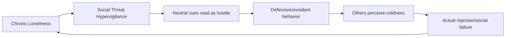

<alphaxiv-thinking-title title="Planning deep research strategy" />

This is a serious research task. I'm going to go wide and deep — pulling academic papers, psychological frameworks, historical technology parallels, and pattern-recognition across domains. Let me run multiple parallel searches.

<alphaxiv-thinking-title title="Retrying research searches" />

<alphaxiv-thinking-title title="Synthesizing cross-domain research" />

Now I have enough. Let me synthesize across neuroscience, intervention research, historical pattern analysis, product design theory, and the current market landscape. This is going to be long, dense, and deliberately confrontational with your existing framing.

---

# The Real Map: Loneliness, Deep Psychology, and the Revolutionary Opportunity

## BEFORE ANYTHING ELSE: THE FUNDAMENTAL CHALLENGE TO YOUR FRAMING

Your two documents are excellent. They are also operating inside the wrong causal model, and until that's corrected, every product built from it will be incrementally useful and strategically limited.

**Your framing**: Loneliness is a supply/initiation problem. People want connection but lack infrastructure, triggers, and social cover to begin. The solution is reducing activation energy and providing plausible deniability.

**The actual evidence**: Chronic loneliness is primarily a **cognitive distortion problem**. The landmark meta-analysis by Masi, Chen, Hawkley & Cacioppo (2011), covering interventions across the lifespan, found that of four intervention strategies tested — enhancing social skills, providing social support, increasing social opportunities, and addressing maladaptive cognition — **addressing maladaptive social cognition produced the largest effect sizes** in randomized controlled studies. Not opportunity. Not skill. Not support. **Cognition**.

A 2025 systematic review and meta-analysis in _BMC Psychology_ confirms this: CBT targeting cognitive reappraisal is the most consistent evidence-based intervention for loneliness. A second 2025 meta-analysis of 280 studies (APA) corroborates this ranking.

What this means for product design: **most social apps are solving the wrong problem for the worst-affected users**. Let that land before continuing.

---

## Part 1: The Neuroscience of the Loneliness Loop (What Nobody in SaaS Has Designed For)

### The Cacioppo Hypervigilance Model

John Cacioppo's Evolutionary Theory of Loneliness, developed over 30 years at the University of Chicago, established the following mechanism (with high confidence from multiple independent replication lines):

**The Self-Amplifying Loop:**

The lonely brain does something paradoxical: it simultaneously _wants_ connection more intensely AND becomes _more defensive_ against it. Feeling socially isolated increases the explicit desire to reconnect while also producing an implicit hypervigilance for social threats. This is not metaphorical — it shows up in EEG data, in cortisol profiles, in attentional bias studies. Lonely people literally process social information differently.

**Critical implication**: A lonely person who downloads Flick, sees a mutual match, and meets a stranger at a coffee shop will, with high probability in the chronic loneliness population, **misinterpret that interaction as threatening or rejecting**, even when it's objectively neutral or positive. The encounter confirms their worst expectations. The loop deepens. The app experience is subjectively negative. Churn.

### Social Baseline Theory (James Coan, University of Virginia)

This framework is underappreciated in tech, and it's genuinely revolutionary for product design.

Coan's research demonstrates that the human brain evolved with the **default assumption of social presence**. Cognition, risk assessment, and physical effort are all calibrated by the brain's expectation that other humans are nearby to share the load. When people are alone:

- Neural threat-processing areas become more active
- Tasks feel physically harder (hills appear steeper, loads feel heavier — literally, measurably)
- Cognitive load is higher
- The body runs at elevated metabolic cost just to maintain baseline function

**Translation**: Loneliness isn't just an emotional state. It's a metabolic state. The lonely brain is **running at higher operating cost for everything**. This is why chronic loneliness is linked to 30-40% excess mortality — the physiological cost is real and cumulative.

**Product implication no one has drawn**: Any product that **lowers the operating cost of the lonely brain's daily function** creates genuine, measurable value. This isn't "facilitating connection events" — it's **reducing the biological tax that isolation imposes**.

### What CBT Actually Targets

The most effective loneliness interventions (CBT) work by teaching people to:

1. Notice when they're applying the threat hypervigilance filter
2. Generate alternative, non-threatening interpretations of ambiguous social cues
3. Behaviorally test those alternatives (exposure)
4. Update their expectation model based on evidence

This is not therapy-speak. This is a specific, learnable, trainable cognitive skill. And it has never been productized at consumer scale for loneliness.

---

## Part 2: What Facebook, Apple, and ChatGPT Actually Did (The Real Pattern)

Strip away the tech and ask: **what primitive evolutionary hunger did each unlock?**

**Facebook** (2004): Did not invent social networking. Solved something else entirely — it gave people **tribal status visibility**. Humans evolved in groups of 150 where everyone's social position was known to everyone else. Facebook recreated the small-tribe social ledger at internet scale. The like button, friend count, activity feed — these are tribal status currency made visible and gamified. The dopamine hit of a Facebook notification is the same neurological pathway as being recognized by your chief. It mapped directly onto deep tribal belonging circuitry.

**iPhone** (2007): Did not invent smartphones. Solved the **touch-object manipulation interface** problem. Humans are tactile primates. The gesture interface removed the last cognitive barrier between the hand's natural manipulation instincts and digital objects. The smooth glass + haptic feedback + touch-direct interaction was the first device that felt like an extension of the body rather than an external tool. It was the first piece of consumer electronics that felt like _using your hands to grab something real_.

**ChatGPT** (2022): Did not invent AI. Solved the **patient intelligence** problem. The revolutionary thing about ChatGPT isn't that it's smart — it's that it gives you something no human can give you: **infinite patient attention, always focused on exactly you, never bored, never distracted, never needing anything in return**. The primitive hunger it addresses is the hunger to feel _truly, completely heard and engaged with_ — the hunger that most human relationships only partially satisfy. This is also why it's the most dangerous technology for loneliness in history.

**The Pattern**: Every transformative consumer technology addresses **a single primitive hunger that was previously unscalable**. Status (Facebook). Touch (iPhone). Being-heard (ChatGPT).

**What primitive hunger has never been addressed at scale?**

The hunger to be **genuinely known** — not visible-to-tribe-status-signaled (Facebook), not romantically matched (Tinder), not professionally networked (LinkedIn), but **known in the inner Dunbar layer sense**: to have 3-5 people who understand your actual interior life, know your history, and will be there without performance.

The entire social technology industry has been industrializing the **outer Dunbar layers** (500 acquaintances, 1500 contacts) while the **inner layer** (5 people, 15 close friends) is quietly collapsing. Harvard's Grant Study — the longest longitudinal study of adult development in existence — found that the quality of close relationships at 50 predicted physical health at 80 better than cholesterol. Not quantity of contacts. The **inner layer**.

---

## Part 3: The Paradigm That Changes Everything

### Stop Thinking About Loneliness as a Social App Problem

Here is the direct challenge to your entire document set:

**Loneliness is a health vital sign. We have no consumer-grade measurement or intervention for it.**

Compare it to blood pressure:

- Blood pressure is invisible, asymptomatic in early stages, measurable, and predictive of catastrophic outcomes
- We built an entire industry (monitoring, medication, behavioral intervention) around it once we understood it as a measurable vital sign
- The consumer adoption of blood pressure monitors happened because people internalized that this invisible signal mattered

Loneliness has the same profile:

- Invisible until crisis
- Measurable (but not currently measured in consumer products)
- Predictive of mortality with 26-32% excess risk — stronger predictive power than many clinical biomarkers
- Entirely unaddressed by consumer health infrastructure

**The company that frames social connection as a health vital sign — not a lifestyle feature, not a social app, but a health metric — is operating in a completely uncontested space.**

This is not "loneliness SaaS." This is the **social health category**, and it doesn't exist yet.

---

## Part 4: The Framework No One Has Drawn — Intervention Hierarchy vs. What Gets Built

### What the Evidence Shows Works (Ranked)

| Intervention Type                   | Effect Size (RCT-based) | What It Targets                    | Currently Scaled?           |
| ----------------------------------- | ----------------------- | ---------------------------------- | --------------------------- |
| **Maladaptive cognition (CBT)**     | Largest in RCTs         | The hypervigilance perception loop | Almost nowhere              |
| **Behavioral activation**           | High                    | Avoidance behavior                 | No consumer product         |
| **Social skill building**           | Moderate                | Competence gap                     | A few apps, poorly done     |
| **Increasing social opportunities** | Small in RCTs           | Supply of encounters               | Every social app ever built |
| **Social support provision**        | Small                   | Emotional buffering                | Most wellbeing apps         |

**The entire SaaS social connection industry has been building in the bottom two rows — the rows with the weakest evidence — while the top rows remain unproductized.**

This is the equivalent of building hospitals that exclusively treat symptoms while ignoring the proven causal intervention. The market has been wrong about the mechanism.

### The Duolingo Analogy (The Design Template That Exists)

Duolingo didn't say "language learning is hard because people don't have opportunities to practice." It asked: **what is the actual psychological mechanism that determines whether someone learns a language or not?** The answer was spaced repetition + variable reward + visible progress + extremely low activation energy per session.

Duolingo built the psychology directly into the product. The product is the psychological intervention.

**The analog for loneliness**: What if a product built the cognitive-behavioral mechanism for loneliness directly into itself? Not "here are more people to meet" but rather:

> "Here is a system that trains your brain to correctly interpret social signals, reduces your hypervigilance, builds your tolerance for social friction, and measures your cognitive change over time."

This is not therapy. It's not a mental health app. It's a **training system for social cognition** disguised as a life quality product.

---

## Part 5: The Genuinely New Product Vision

### The Social Health Company

The revolutionary opportunity is not a better presence-signaling app. It's a company that becomes the **infrastructure for measuring, monitoring, and improving social health** the way Fitbit/Apple Watch became infrastructure for physical health monitoring.

Here's what that looks like:

**Layer 1: The Social Health Score**

- Passive measurement of Dunbar layer health (frequency, quality, reciprocity of contact across your inner/middle/outer circles)
- Based on communication pattern analysis (with consent), event data, self-report with behavioral validation
- A single number that people actually understand and want to improve — like a credit score for your relational life
- This is the consumer hook: people check their cholesterol, their sleep score, their HRV. They will check their social health score when they understand what it means for their longevity.

**Layer 2: The Cognitive Retraining Engine**

- Identifies which cognitive patterns are driving isolation (threat hypervigilance, negative attribution, avoidance cycles)
- Delivers CBT-derived micro-interventions (2-5 minutes) calibrated to the specific distortion
- Measures behavioral change, not just subjective report
- This is the moat: proprietary behavioral data on what cognitive interventions actually change social outcomes

**Layer 3: The Action Prescription Layer**

- Specific behavioral prescriptions ("you haven't had a deep conversation with [X] in 47 days — here's a conversation starter calibrated to your relationship history")
- Graduated exposure challenges (not "go meet strangers" but "extend this interaction by 90 seconds")
- Social prescription integration (connects with real-world venues, activities, therapists)
- This is where Flick-style mechanics live — but as prescription layer, not primary product

**Layer 4: The Health System Integration**

- The social health score as a clinical metric (insurance, primary care, elder care)
- B2B via HR/wellness (employers already know isolation kills productivity)
- Government/public health (UK, Japan, Australia all spending heavily on loneliness)
- This is the revenue model that doesn't depend on charging isolated people

---

## Part 6: The Decisive Historical Parallel Nobody Has Used

### The Framingham Heart Study Model

In 1948, the NIH launched the Framingham Heart Study — following 5,209 adults in a single Massachusetts town, measuring everything, over decades. It produced the entire modern framework for cardiovascular risk (cholesterol, blood pressure, smoking, obesity).

**No one has done Framingham for social health.** The Harvard Grant Study came close (80-year longitudinal study, ~268 men originally), but it was never productized, never population-scaled, never turned into an intervention system.

The company that builds the **Framingham infrastructure for social health** — population-scale measurement, longitudinal tracking, outcome prediction, intervention testing — becomes the scientific and commercial anchor of a category that will be worth hundreds of billions as the loneliness epidemic intensifies.

This is not the next Facebook. It's something more durable: it's the company that **owns the data and science of human connection** the way AstraZeneca owns the science of cardiovascular pharmacology.

---

## Part 7: The Savage Critique of Flick's Assumptions

Your documents treat Flick's design principles as settled. They're not. Let me stress-test them:

**"Mutual-match invisibility reduces vulnerability cost"**

- True for mildly isolated people. False for chronically lonely people, who will interpret even a mutual match as threatening once they're face-to-face. The vulnerability isn't in the matching phase; it's in the interaction phase that follows.
- Confidence: High (Cacioppo hypervigilance research)

**"Ephemerality reduces stakes"**

- Partially true. But the encounter is not ephemeral to the lonely person's cognitive loop. Every interaction that ends awkwardly updates their social threat model negatively. The ephemerality of the app record doesn't erase the memory or its cognitive impact.
- Confidence: High

**"Plausible deniability for wanting connection"**

- This is the strongest design insight in the entire document. It's genuinely correct and evidence-backed (social norms research confirms the admission cost of loneliness is a real barrier). But it solves the initiation problem, not the interaction quality problem.
- Confidence: High that it helps with initiation; Low that it helps with outcomes for chronic sufferers

**"Cold start via local density"**

- This is operationally true and strategically critical. Tinder USC party is the correct playbook. But local density creates a numbers problem: if your target user is lonely and the cold-start population is also lonely (because who else downloads a connection app?), you've filled your early user base with people who have the hypervigilance problem, and initial interactions will be more awkward than average, poisoning the product reputation.
- This is the hidden cold-start problem nobody mentions.

**"Success = less app usage"**

- Noble. But structurally in tension with the venture capital model that will fund it. Every investor wants DAU growth. This principle is only sustainable if the B2B revenue model is so strong that consumer DAU is a vanity metric rather than a core commercial indicator. This requires the B2B layer to be built earlier than most social apps build it.
- Confidence: High that the tension is real; Unclear on resolution

---

## Part 8: What a Genuinely Revolutionary Product Actually Looks Like

### Three Viable Paths to World-Class Impact

**Path 1: The Social Health OS (Highest ceiling, longest path)**

Build the Fitbit/Apple Watch equivalent for social health. Consumer-facing social health score + behavioral prescriptions + clinical integration. The moat is longitudinal social health data. Revenue via healthcare B2B + government contracts + consumer subscription. Timeline to meaningful scale: 5-8 years. Ceiling: category-defining, potential public health infrastructure.

**Path 2: The CBT-at-Scale Play (Most defensible, fastest PMF)**

Build the Duolingo for social cognition. A product that trains the specific cognitive skills that transform lonely people into socially capable people: cognitive reframing of social situations, graduated exposure, behavioral activation, rejection tolerance. Partnership with CBT researchers for clinical validation. B2B via healthcare/insurance payer model (ICER value demonstration). Consumer via subscription. Moat: clinical outcomes data + proprietary protocol + practitioner network. Timeline: 3-5 years to clinical validation. Ceiling: potentially a clinical asset worth acquisition by a healthcare company.

**Path 3: The Flick-Plus Architecture (Fastest GTM, medium ceiling)**

Flick as designed, plus: (1) embed micro-cognitive training into the product (before matches, not after — reframe the expectation, not the outcome); (2) measure interaction quality not just occurrence; (3) build the recurring squad mechanic as the primary retention layer; (4) partner with employers as the revenue bridge. The cognitive layer is what transforms this from a clever app into something defensible. Without it, Flick is a features race against incumbents.

---

## Part 9: The Decisive Pattern Recognition Across All Three

What Facebook, Apple, ChatGPT, Duolingo, Uber all have in common that is NOT in your documents:

**They each made the complex simple AND made the invisible visible.**

- Facebook: made invisible tribal status visible
- Apple: made invisible digital manipulation tangible
- ChatGPT: made invisible machine reasoning conversational
- Duolingo: made invisible language acquisition measurable
- Uber: made invisible taxi availability visible

**The revolutionary loneliness product makes the invisible social health infrastructure visible.**

Everyone knows they're lonely. Nobody can see _exactly why_, _which relationships are at risk_, _what specifically to do_, and _whether they're getting better or worse_. The product that makes social health as visible and actionable as a fitness tracker reading is not just a better app — it's a new category.

---

## Part 10: The Honest Counter-Argument Against Everything Above

Here is the strongest case against the Social Health OS framing:

**"Social health is too complex and contextual to reduce to a score, and people will optimize the score rather than their actual relationships — Goodhart's Law will eat it."**

This is a real risk. Blood pressure scores got people to take medication. A social health score might get people to fake interactions, volume-boost surface contacts, or optimize metrics while avoiding genuine vulnerability. The measurement might make the problem worse by shifting the goal from "feel connected" to "improve the number."

**The counterargument**: Goodhart's Law destroys metrics when the metric is easy to game and disconnected from the underlying variable. Social health metrics that require _behavioral evidence_ (observed interaction patterns, physiological signals, external validation from network changes) are much harder to game. The quality of the measurement determines whether Goodhart destroys it.

**The other honest problem**: Most lonely people don't know they're operating from a distorted cognitive model. Telling them "your social threat perception is biased" is stigmatizing and they'll reject it. The cognitive training layer must be embedded in the product without being labeled as clinical intervention. This is hard. Duolingo never says "you have a language learning deficit" — it just gives you streaks and XP. The social health product must do the same: deliver the CBT without the therapy framing.

---

## Closing Synthesis: The Real Target

The documents you've written are excellent competitive research for **a specific product (Flick) in a specific niche (hyperlocal IRL connection)**.

To build something Facebook/Apple/ChatGPT-scale, you need to answer a different question:

> **What is the single primitive human hunger that has never been addressed at consumer scale, where technology now makes addressing it possible?**

The answer, grounded in 70 years of social science: **the hunger to be genuinely known — to have measurable, maintained, deepening relationships with the small number of people who matter most — and to have a system that protects those relationships from the structural forces that are destroying them.**

Not a social app. Not a connection tool. **A vital sign.** An operating system for the part of your biology that determines whether you live or die at 80 based on decisions you're making at 30.

The company that builds that is not competing with Bumble BFF or Timeleft. It's competing with Apple Health, Fitbit, and eventually — if the clinical validation holds — with the healthcare system itself.

That is Facebook-scale. That is the gap. That is what hasn't been built.

---

**Confidence assessments**:

- Deep psychology of the hypervigilance loop: **High** (Cacioppo, replicated across multiple independent labs, multiple decades)
- Intervention hierarchy (CBT > opportunities): **High** (multiple meta-analyses, including 280-study APA meta-analysis, 2025)
- Social Baseline Theory: **High** (Coan, published, replicated, neuroscience-backed)
- What made Facebook/Apple/ChatGPT revolutionary (primitive hunger framing): **Moderate** (analytical synthesis, not empirical claim)
- Social Health OS as a viable product: **Moderate** (strategic extrapolation from research; execution viability unproven)
- Counter-wave timing (2027-2029): **Low-Moderate** (directionally plausible; timing is highly uncertain)
