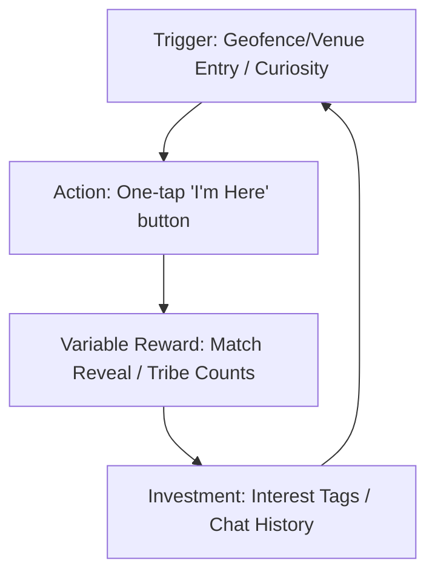

# Flick — Complete Revenue Model, Monetization Architecture & Psychological Retention Engine

## A Deep-Research Report for the Founder | June 2026

## Executive Summary

Flick is the ambient social layer for physical reality — a proximity-based, mutual-match, ephemeral social discovery PWA targeting urban Indian adults aged 18–32, built on the insight that the enemy of human connection is not distance but the activation energy of the first move. This report delivers a fully engineered, psychologically grounded, India-market-calibrated revenue model; a multi-tier pricing architecture with real INR numbers; a complete Psychological Retention Engine covering notification systems, habit loops, dopamine triggers, and algorithmic engagement mechanics; and the specific metrics (MRR, LTV, CAC, churn) that define whether this business works.

---

## Part 1 — The Revenue Model: First Principles Deconstruction

### 1.1 The Core Problem With "Build It, Monetize Later"

The single most common cause of consumer social app death is not failure to acquire users — it is failure to build a monetization architecture that is coherent with the core product mechanic. The trap is treating revenue as something bolted onto a product that was never designed to generate it. Flick must be designed from Day 1 such that paying feels like a natural continuation of the experience, not an interruption of it. Flick's monetization pricing architecture, feature gates, INR price points, UPI-native payment flow, upsell triggers, and B2B sales motion are defined below.

### 1.2 Flick's Revenue Model: The Three-Layer Stack

Flick's monetization is a three-sided revenue machine that derives income simultaneously from:

1. Individual users (B2C subscriptions)
2. Venues (B2B SaaS)
3. Data intelligence (B2B2C analytics)

These three layers are structurally independent, but they amplify each other because the B2B venue partnerships solve the cold-start problem that makes the B2C subscriptions valuable enough to buy.

#### Layer 1: Flick Free (Acquisition Engine)

The free tier is the acquisition mechanism for both paid tiers. It must be engineered to deliver exactly enough value to make the product indispensable, and exactly insufficient value to make power users feel the ceiling. The specific signal cap is set to **5 per 30-day rolling period**. The free tier's job is to get a user to their activation event — their first mutual match — after which the product's core value is proven, and the upgrade conversation becomes logical rather than persuasive.

#### Layer 2: Flick Plus (B2C Subscription — Primary Revenue)

- **Pricing:** ₹149/month or ₹999/year.
- **Indian Market Fit:** The proven sweet spot for mobile apps targeting 18–32-year-old urban professionals is ₹99–₹149/month. The annual option at ₹999 represents a 44% discount, creates a 12-month commitment moat, and reduces churn via the sunk cost effect.

##### Flick Plus Feature Gates:

- **Unlimited Signals** (vs. 5/month on Free): The highest-converting gate in freemium.
- **Radius Precision Control** (500m / 1km / 2km granular vs. fixed default on Free).
- **Signal Replay**: A heat map showing when and where the user historically finds the highest match density, converting behavioral data into premium product insights.
- **Extended Match Windows** (90 min → 3 hours on Plus).
- **Priority Matching Queue**: Signals are surfaced slightly higher in discovery, framed as "your signal reaches more compatible people."
- **Permanent Connections Chat**: Free users are limited to 10 messages/day per connection; Plus users get unlimited messaging. Losing Plus access means losing ongoing relationships, driving near-zero churn.

#### Layer 3: Flick for Venues — B2B SaaS (Primary Margin Engine)

- **Pricing:** ₹2,000–₹8,000/month per venue, tiered by city, venue size, and feature set.
- **Market Fit:** Replaces broad marketing spend (Instagram, Zomato) with targeted, measurable local foot traffic tools.

| Tier                  | Price/Month | Deliverables                                                                                                                                                                                  |
| --------------------- | ----------- | --------------------------------------------------------------------------------------------------------------------------------------------------------------------------------------------- |
| **Warm Spot Basic**   | ₹2,000      | Venue appears as a "warm spot" on the map to all nearby users; monthly signal count dashboard.                                                                                                |
| **Warm Spot Pro**     | ₹4,500      | Everything in Basic + demographic insights (age range, interest clusters), "Flick Venue Partner" badge, ability to post one "venue signal" per week (e.g., "Open mic tonight — who's here?"). |
| **Warm Spot Premium** | ₹8,000      | Everything in Pro + weekly foot traffic analytics, heatmap of peak Flick activity hours, priority placement in discovery list, white-label "Flick at [Venue Name]" event hosting capability.  |

---

## Part 2 — Pricing Psychology: Why These Numbers, Not Others

### 2.1 India-Specific Pricing Architecture

- **Sachet Pricing:** Indian consumers demonstrate a higher willingness to pay for low-cost, high-perceived-value subscriptions. ₹149/month is anchored against a cutting chai + vada pav per day.
- **Annual Pricing Moat:** The ₹999/year price point sits below the ₹1,000 psychological barrier. UPI infrastructure enables instant, frictionless one-tap payment without recurring card mandate friction.
- **The 7-14 Day Conversion Window:** Freemium-to-paid conversions peak within the first two weeks after a user's first match. Conversion probability drops by ~70% after 30 days of free usage, making prompt timing critical.

### 2.2 The Paywall Trigger Architecture

- **Signal #4 Trigger (Proactive):** Shown on the 4th signal in a 30-day period: _"You have 1 signal left this month. Flick Plus gives you unlimited — and your match rate tends to be 40% higher in your second week."_
- **Post-Match Peak (Emotional):** Shown immediately within the match reveal animation: _"You've matched 3 times in 2 weeks. Plus users average 2x more matches per month. Unlock unlimited."_
- **Connection Ceiling (Retention-to-Revenue):** Shown when reaching the 10-message/day limit: _"You've started something real. Don't lose the thread — Flick Plus gives you unlimited messages."_
- **Signal Replay Teaser (Curiosity):** Blurred Signal Replay heatmap shown after 2 weeks: _"You get 3x more matches at specific times and places. Unlock your map."_

---

## Part 3 — The Psychological Retention Engine

### 3.1 The Nir Eyal Hook Model — Applied to Flick

The goal is to transition users from external triggers (push notifications) to internal triggers (involuntary emotional association between physical presence in a public space and the impulse to open Flick).

- **The Trigger Layer:**
  - _External Phase 0 (Days 1–7):_ Contextual pushes on geofence entry (e.g., _"You're at a café. Anyone nearby is open right now"_).
  - _External Phase 1 (Days 7–30):_ Social proof triggers (e.g., _"Someone near you is signaling the same intent you used last Tuesday"_).
  - _Internal Phase 2 (Day 30+):_ Associating the physical space with social curiosity, leading users to open the app automatically.
- **The Action Layer:** Minimize cognitive friction. The app must open directly to the active signal state or match screen, not a loading/onboarding screen.
- **The Variable Reward Layer:**
  - _Reward of the Tribe (Social validation):_ Real-time socket-based nearby counts (e.g., "3 people nearby and open right now") that vary unpredictably.
  - _Reward of the Hunt (Discovery):_ The full-screen, unhurried, tactile match reveal animation.
  - _Reward of the Self (Identity/Mastery):_ Personal stats, reputation score, and Signal Replay heatmap.
- **The Investment Layer:** Interest tags, venue check-ins, chat logs, reputation scores. Every data point must return visible insight to make switching costs high.

### 3.2 The Notification Architecture: The Complete Playbook

| Category                  | Trigger                      | Copy Example                                                      | Psychological Mechanism             | Frequency Cap                       |
| ------------------------- | ---------------------------- | ----------------------------------------------------------------- | ----------------------------------- | ----------------------------------- |
| **Proximity Pulse**       | Geofence entry               | "Coffee and company — 4 people are here and open."                | Context-activated curiosity         | Max 2/day, only if no active signal |
| **Nearby Count Update**   | Signal active + count change | "2 more people just signaled near you."                           | Variable reward                     | Real-time, during active signal     |
| **Match Reveal**          | Mutual match created         | "You matched. See who it is."                                     | Jackpot / Dopamine release          | Unlimited                           |
| **Match Window Expiring** | 15 min remaining in window   | "Your match window closes in 15 min. Don't let it expire."        | Zeigarnik Effect (incomplete loop)  | Once per match                      |
| **Signal Expired**        | Signal expires               | "Your signal expired. Drop another one tomorrow."                 | Loss framing                        | Once per expiry                     |
| **Re-engagement**         | 5+ days dormant              | "It's been 5 days. Someone interesting might be at [last venue]." | Social curiosity / Location memory  | Once per 5 days                     |
| **Connection Activity**   | Message received             | "[Name] sent you a message."                                      | Social reciprocity                  | Unlimited                           |
| **Streak Nudge**          | Match 2+ weeks in a row      | "You've matched 3 weeks running. You're on a streak."             | Streak psychology (Duolingo effect) | Weekly                              |
| **Upgrade Nudge**         | Hit signal #4 (Free tier)    | "1 signal left this month. Unlock unlimited signals."             | Scarcity / Loss aversion            | Once per billing cycle              |
| **Venue Hot Moment**      | Venue partner signal         | "Something's happening at [Venue]. People are signaling."         | FOMO / Social proof                 | Max 1/venue partner/day             |

### 3.3 The Algorithmic Engagement Engine

#### Algorithm 1: The Social Cluster Detection Engine

Tracks co-occurrence patterns of signals. When two user IDs have been in physical proximity 3+ times without matching, trigger a serendipity nudge: _"You've been in the same space as someone interesting 4 times this month. The moment might be now."_ (Calculated using PostGIS co-occurrence queries).

#### Algorithm 2: The Intent Affinity Scorer

Converts user intents ("studying for GATE", "getting coffee") into embeddings using OpenAI's `text-embedding-3-small`. Builds an interest affinity graph to prioritize surfacing matching profiles.

#### Algorithm 3: The Venue Heat Calibrator

Aggregates rolling 30-day signal density per venue to predict peak social windows and deliver preemptive pushes: _"Peak time at [Venue] is usually between 7–9pm on Thursdays. That's tonight."_

#### Algorithm 4: The Churn Prediction & Intervention Layer

Triggers when a user hasn't opened the app in 4+ days, their last session ended matchless, or they hit the free cap without upgrading. Delivers a contextual push: _"The last time you signaled at [venue], you matched. That venue is active again right now."_

---

## Part 4 — Unit Economics & Projections

### 4.1 12-Month Projections (Single City Launch - Bangalore)

- **Assumptions:** Month 1: 1,500 users. Month 6: 18,000 MAU. Month 12: 55,000 MAU. Free-to-paid conversion: 5%. Annual-to-monthly subscriber ratio: 40:60. Blended Plus ARPU: ₹140/month. Blended Venue SaaS: ₹3,500/month.

| Month        | MAU    | Plus Subscribers | B2B Venue Partners | Monthly Revenue |
| ------------ | ------ | ---------------- | ------------------ | --------------- |
| **Month 1**  | 1,500  | 75               | 3                  | ₹17,175         |
| **Month 3**  | 6,000  | 300              | 12                 | ₹68,700         |
| **Month 6**  | 18,000 | 900              | 30                 | ₹206,100        |
| **Month 9**  | 35,000 | 1,750            | 55                 | ₹400,250        |
| **Month 12** | 55,000 | 2,750            | 85                 | ₹629,750        |

- **MRR at Month 12:** ~₹6.3 Lakh (~$7,500 USD)
- **ARR Run Rate at Month 12:** ~₹75 Lakh (~$90,000 USD)

### 4.2 LTV:CAC Framework

- **LTV (Plus subscriber):** ₹140 ARPU × 8 months = ₹1,120.
- **CAC (Blended):** ₹45–₹70 (assumes 50% organic referral, 50% event-driven/campus activation).
- **CAC per Paid Subscriber:** ₹45 / 0.05 = ₹900.
- **LTV:CAC Ratio:** 1.25:1 at launch (Target: 3:1 by Month 12 through conversion rate optimization and churn reduction).

---

## Part 5 — The Complete Hybrid Revenue Model: New Streams

### 5.1 Revenue Stream 4: The Signal Credits Economy

Consumable in-app currency for micro-transactions via UPI (instant, cardless):

- **Extended Radius Boost:** Expand signal radius from 1km to 5km for one broadcast. Price: ₹19/credit or 3 for ₹49.
- **Signal Pin:** Keep signal active for 3 hours instead of 90 minutes without consuming a monthly cap. Price: ₹29/pin.
- **Venue Spotlight:** Pin signal to the top of a specific venue's user stack. Price: ₹39/spotlight.

### 5.2 Revenue Stream 5: Flick for Events — Temporary Venue Packages

- **Price:** ₹5,000 flat fee per event (college fests, concerts, conferences).
- **Features:** Creates a temporary geofence bubble, permits one 2km push notification, attaches event tag to users, and provides post-event analytics.

### 5.3 Revenue Stream 6: The Aggregated Intelligence Layer (Year 2+)

Anonymized aggregate foot traffic and demographic co-presence data sold to B2B enterprise buyers (CPG, commercial developers, urban planners) at ₹50,000–₹5,00,000 per report.

---

## Part 6 — The UX of Monetization

### 6.1 Positioning

Do not list features mechanically. Paint a picture of who the user becomes with Flick Plus:

> _Some people walk into a room and the room changes. They are just open. Flick Plus is for them — for you. Unlimited signals. No ceilings. Just the map of everywhere you've found something real._

### 6.2 Visual Layout & Checkout

1. **Hero Element:** Live-rendered, full-color (unblurred) Signal Replay heatmap using the user's actual history.
2. **Social Proof:** Live counters (e.g., _"2,847 people in Bangalore matched on Flick this week"_).
3. **Single CTA:** Clear payment button with the annual subscription option pre-selected.
4. **UPI Checkout:** Integrated via Razorpay for <10-second checkout flow.

---

## Part 7 — Anti-Patterns to Avoid

1. **Dark Notification Patterns:** Never send fake notifications or false matches. A "nearby" notification must map to a real active user.
2. **Engagement Metrics over Outcome Metrics:** Measure match success (did users keep in touch?) instead of session length or clickbait engagement.
3. **Pay-to-Win Perception:** Avoid displaying visible "paid user" badges on signals. Keep premium visibility boosts subtle and algorithmic.
4. **Subscription Fatigue from Premature Gating:** Only prompt the subscription paywall after the user has experienced at least one successful mutual match.
5. **Annual Churn Neglect:** Begin re-investment campaigns 90 days before annual renewals (show Year-in-Review, offer early renewal discounts).
